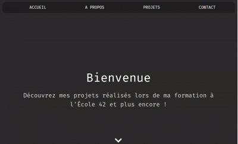

# Portfolio

Bienvenue sur le repo de mon portfolio personnel ! Ce projet a été conçu pour mettre en valeur mes compétences, mes projets et mon parcours. 

👉 **[Visitez mon portfolio ici](https://agaelleb.github.io/)**

---

## 🖥️ Objectif du projet

L’objectif principal de ce site est de fournir une plateforme pour présenter mes **projets réalisés** dans le cadre de ma formation à l'école 42 ainsi que mes projets personnels.

---

## 🚀 Fonctionnalités clés

- **Présentation** : Chaque projet est détaillé avec une description, les technologies utilisées, et des liens vers le code source.
- **Responsive Design** : Adapté à tous les écrans (ordinateurs, tablettes, smartphones).
- **Navigation fluide** : Animations douces et interface intuitive.

---

## 🛠️ Technologies utilisées

Ce portfolio a été conçu entièrement en **HTML**, **CSS**, et **JavaScript**

### Développement :
- **HTML5** et **CSS3** : pour la structure et le style.
- **JavaScript** : pour les interactions dynamiques.
- **Bootstrap 5** : pour une mise en page responsive et des composants élégants.
- **AOS (Animate on Scroll)** : pour les animations lors du défilement.
- **Font Awesome** et **Bootstrap Icons** : pour les icônes.
- **Devicon** : pour afficher les logos des technologies utilisées.

### Outils :
- **GitHub Pages** : Hébergement gratuit et déploiement facile.
- **VS Code** : Environnement de développement.

---

## 📸 Aperçu visuel

---

## 🌍 Visitez le site

**[Accédez au site en ligne](https://agaelleb.github.io/)**

---

## 📝 Notes supplémentaires

- Ce portfolio est un **projet en constante évolution**. J’ajoute régulièrement de nouvelles fonctionnalités.
- Si vous avez des retours ou des suggestions, n’hésitez pas à me contacter directement via mon [LinkedIn](https://www.linkedin.com/in/anne-gaëlle-bonnefoy-3b7348107/).

---

## 📧 Contact

Anne-Gaëlle Bonnefoy  
- **Linkedin** : [Anne-Gaëlle](https://www.linkedin.com/in/anne-ga%C3%ABlle-bonnefoy-3b7348107/)  
- **GitHub** : [AGaelleB](https://github.com/AGaelleB)

---
